### 1. Markov Decision Process

#### Basics

​	马尔可夫决策过程指的是一类当前行为会影响到当前以及之后的回馈的决策过程。通常的，agent和environment的交互可以以这张图来表示：

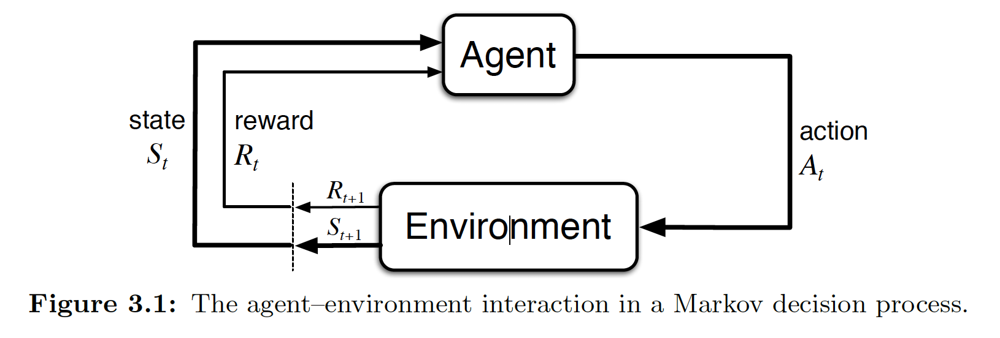

那么agent的状态、行为、收益可以用这样的一个序列表示：
$$
S_0,A_0,R_1,S_1,A_1,R_1,S_2,A_2,R_3,...
$$
MDP的动态过程就可以使用这样的一个四元概率函数表示：

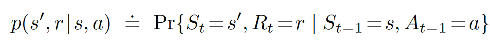

该函数表示在s状态下执行a之后，新的状态s'和回馈r的联合概率函数，我们可以很容易发现对所有的s'和r的概率求和，结果为1，即：

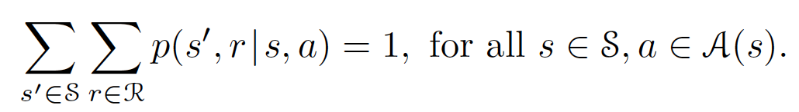

同样的，在给定s状态下执行a之后，到达状态s'的概率为：

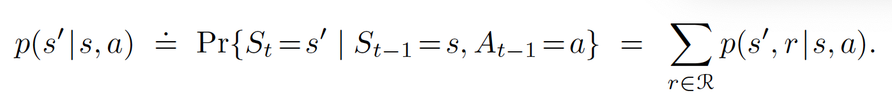

在s状态下执行a的期望收益为：

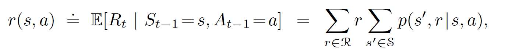

状态-行为-下一状态的三元联合概率为：

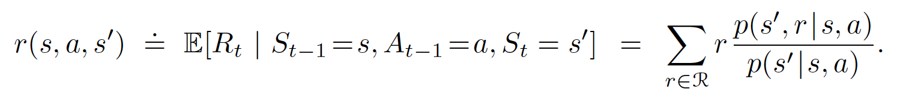

#### Returns

如何来描述期望回馈（return）呢？可以使用从当前阶段之后所有阶段的累计收益（reward），当然，对于非有限马尔可夫决策过程，为了使回馈级数收敛，我们可以给收益乘上一个衰减系数$\gamma\in[0,1]$: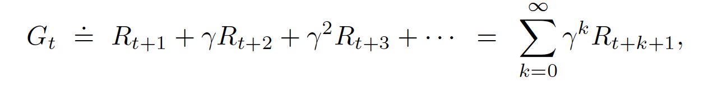

#### Policies and Value Functions

Policy 表示一个从选择行动的方式到概率的映射，如：$\pi(a|s)$表示在s状态下进行a行动的概率

value function，亦称state-value function for policy $\pi$，表示从状态s开始，通过policy $\pi$ 来行动，得到的期望回馈：

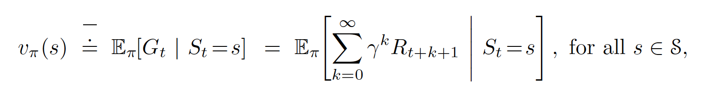

特别注意的是，最终状态的回馈为0

对于在状态s下选择了行动a之后，再通过policy $\pi$来行动的value，可以用一个action-value function来表示：

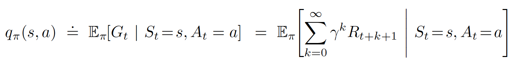

最优value函数：

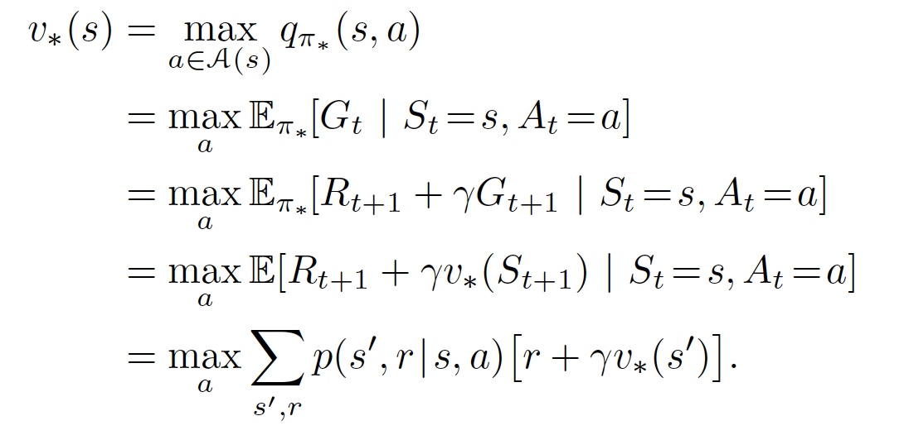

最优q函数：

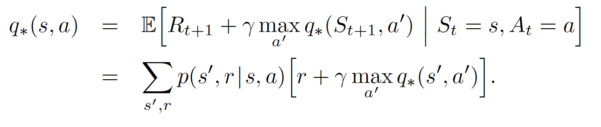

#### 贝尔曼方程

该方程表征了一个状态的value与其后继状态value之间的关系：

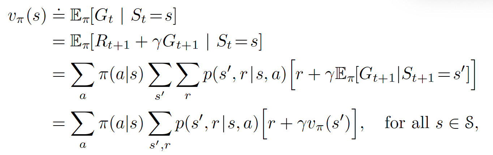

### 2. Dynamic Programming

​	对于环境已知（已知各个状态，状态之间的关系，从一个状态转移到另一个状态的reward）的情况，我们可以使用DP来形成最优策略，以获得最大的收益，通过Bellman方程我们可以将value function改写成近似的迭代形式：

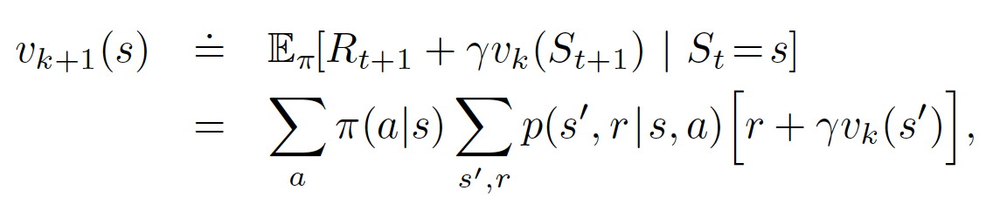

该方程表明，第k+1次迭代时，s状态的value可以由s的后继状态第k次迭代时的value生成。

#### Policy Iteration

​	我们可以通过优化policy来获得最大收益，利用$v_\pi$生成一个更好的policy $\pi'$ 后，我们可以迭代地，通过不断的策略评估和策略更新来生成更好的policy，直到最终形会成最优策略，（为什么贪心算法可以形成全局最优？因为value函数包含了从当前状态到最终状态的所有value信息）算法如下：

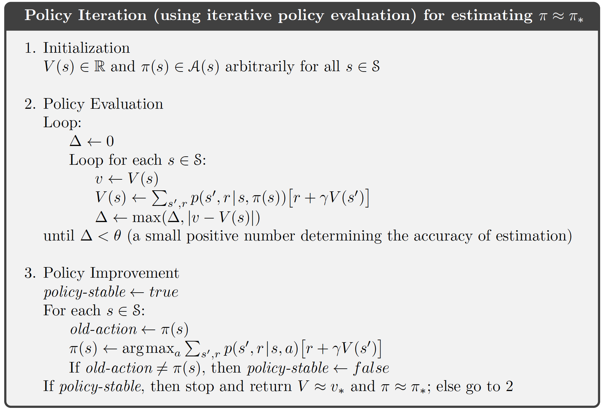

#### Value Iteration

​	Policy Iteration的一个缺点是每次迭代过程都需要进行policy评估，而每一次的策略评估都会遍历一遍状态集合，这就使迭代的计算开销比较大。事实上，我们可以对Policy Iteration进行截断，并且将Policy Improvement也包含在迭代过程中，这种方法称为Value Iteration，将Bellman最优方程改为迭代的形式：

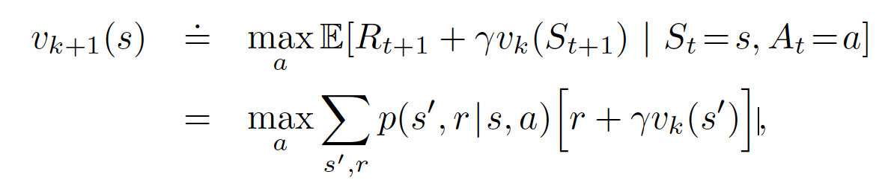

因为该迭代过程保证了 $v_*$ 是不会消失的，所以序列{$v_k$}最终会收敛到$v_*$，算法如下：

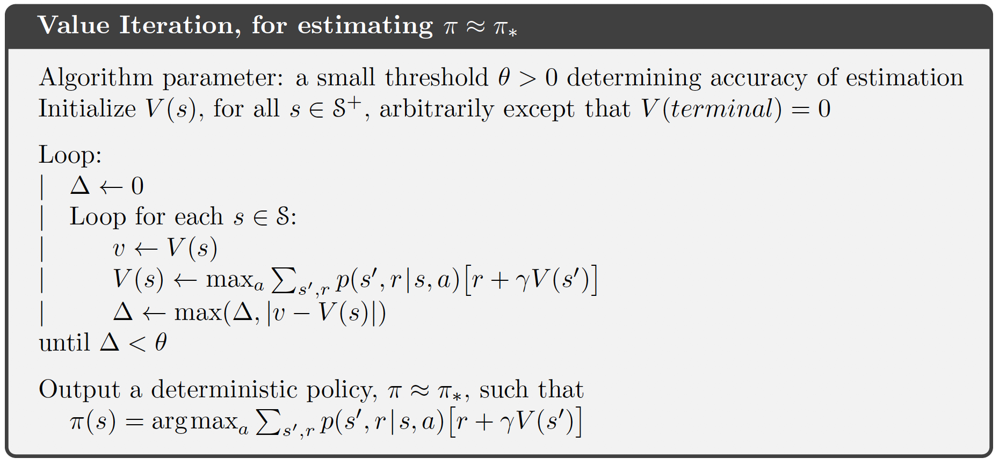

