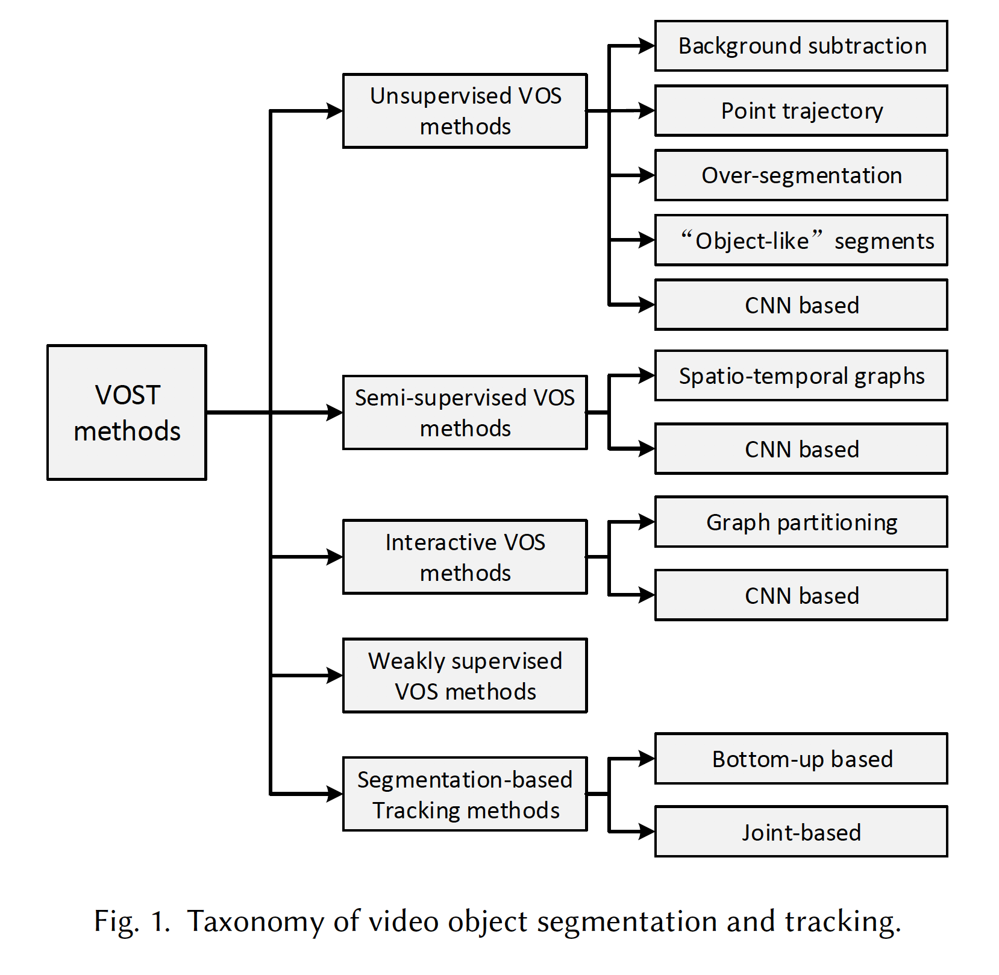
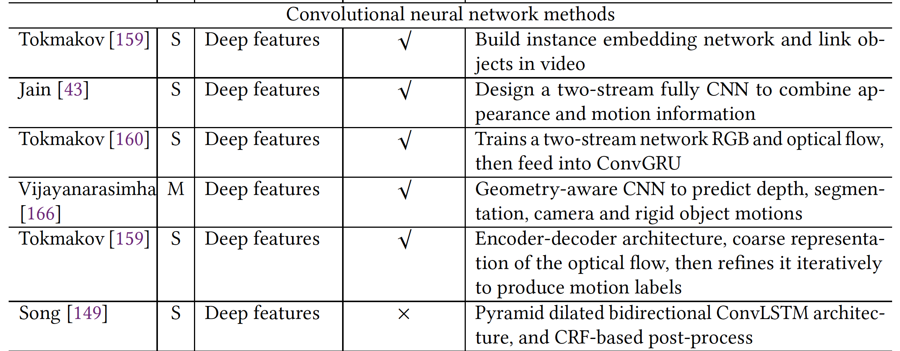

### 1. 方法分类

### 2. 主要方法

#### 2.1 无监督分割方法

* background subtraction

  将快速变化的像素点作为前景，用于表示运动的物体

  * 静态背景

    使用高斯混合模型给背景颜色建模，从而便于检测场景中的运动物体

  * 动态2D背景

    当照相机仅做缩放和旋转时可用

  * 动态3D背景

    照相机进行了转换，或有明显的场景深度改变

  以上方法局限于摄像机静止或运动缓慢，且无法应对非刚性物体

  

* point trajectory

  使用物体轨迹来分析运动。生成轨迹，对轨迹聚类，通过聚类后的轨迹来生成结果

  * 基于视觉漂移的方法

    基本假设：1. 物体在运动过程中亮度不变； 2. 非剧烈运动

  * 基于特征跟踪的方法

    对基于视觉漂移存在的无法应对运动慢的情况进行改进

  以上方法不能解决频繁的像素点遮挡问题，且没有利用物体的外貌特征

  

* over-segmentation（过度分割）

  基于颜色、亮度、纹理相似度来给像素点分组，生成时-空的分割图。是基于**图论**的算法，将每个像素点作为图的一个结点

  * superpixel representation
  * supervoxel representation

  缺点：

  > sensitive to boundary strength uctuations from frame to frame

  * “objet-like” segments

  对每一帧生成前景物体的假设

  * Salient objects
  * Object Proposals

  缺点： 

  经常把背景生成为物体，降低了物体分割的准确度，并且计算开销很大

* CNN methods

  优点：无需使用人工标记，自动生成主要物体并传播到后续帧中

  缺点：不能分割具体的一个物体，且计算开销大

  

